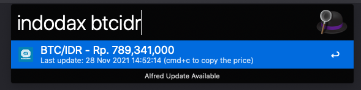

# alfred-indodax [](https://travis-ci.org/ace3/alfred-indodax)

> Get last price from Indodax exchange


## Install

```
$ npm install --global alfred-indodax
```

*Requires [Node.js](https://nodejs.org) 4+ and the Alfred [Powerpack](https://www.alfredapp.com/powerpack/).*


## Usage

- In Alfred, type `indodax` <kbd>space</kbd> `the pair of the coin, something like BTCIDR`, and you will get the result.
- <kbd>CMD + C</kbd> to copy the price.

## Example Command
- `indodax btcidr ?amount`

## Screenshots
`indodax btcidr`


## License

MIT © [Ignasius Wahyudi](https://ignasius.dev)
