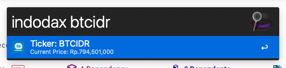

# alfred-indodax [](https://travis-ci.org/ace3/alfred-indodax)

> indodax price


## Install

```
$ npm install --global alfred-indodax
```

*Requires [Node.js](https://nodejs.org) 4+ and the Alfred [Powerpack](https://www.alfredapp.com/powerpack/).*


## Usage

In Alfred, type `indodax` <kbd>space</kbd> `the pair of the coin, something like BTCIDR`, and you will get the result.

## Example
`indodax BTCIDR`

## Screenshots


## License

MIT © [Ignasius Wahyudi](http://ignasius.dev)
